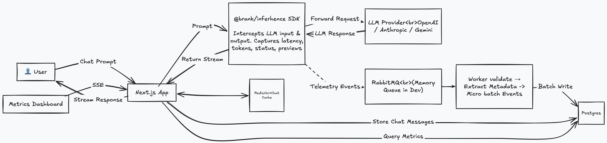

# Architecture

Brank is a **producer/consumer** system. The Next.js app produces inference events while it
streams chat responses; a standalone **worker** consumes those events and writes
append-only telemetry to Postgres. This decouples chat latency from telemetry writes: a slow
or paused database write never delays a token reaching the user.

---

## Components

### App (Next.js 16, Bun runtime)

The app is the **producer** plus the user-facing surface.

- **`app/api/chat`** — streams completions via the `ai` v7 SDK, wrapped by `@brank/inferhence`
  so every request emits a telemetry lifecycle. Provider selection is driven by the
  multi-provider registry (`packages/providers`), which supports browser-supplied API keys
  (bring-your-own-key) as well as server-side env keys.
- **`app/api/ingest`** — the SDK's HTTP transport target. Validates each event (zod),
  redacts previews a second time, and enqueues it onto the queue.
- **`app/api/metrics`** — SSE feed of rolling aggregates for the dashboard.
- **`app/api/conversations`, `models`, `auth`, `health`** — conversation CRUD, model
  discovery, auth, and liveness/readiness probes.
- **`lib/`** — app glue: `db.ts`, `auth.ts`/`auth-client.ts` (`better-auth`), `chat-cache.ts`
  (Redis), `ingestion-service.ts`, `logger.ts` (`pino` + `withLogging` wrapper), `config.ts`.

### Worker (`packages/ingestion`, Bun)

A standalone process (`worker.ts`) that drains the queue and writes to Postgres. It can also
run in-process inside Next.js when no broker is configured — same code path, no broker.
Details in [Worker](#worker).

### Packages

| Package | Responsibility |
|---------|----------------|
| `packages/db` | Prisma schema, client generation, pg adapter |
| `packages/inferhence` | Provider-agnostic, PII-safe telemetry SDK (see its [README](./packages/inferhence/docs/README.md)) |
| `packages/ingestion` | Worker, queue adapters, prisma store, metrics aggregator |
| `packages/providers` | Multi-provider registry (incl. OpenAI-compatible / LM Studio) |

---

## Worker

`packages/ingestion/src/worker.ts` is a Bun process that:

- Connects to the queue and consumes `brank.inference.events`, using `RABBITMQ_PREFETCH` as
  the in-flight limit (RabbitMQ) or an equivalent capacity for the in-memory adapter.
- Validates each event, extracts structured metadata into `ExtractedMetadata`, and
  bulk-inserts with `skipDuplicates` (`id` PK) for idempotency — safe under at-least-once
  delivery.
- Retries a failed batch up to `INGESTION_MAX_RETRIES`, then nacks to the DLQ so a single
  poison message can't wedge the queue.
- Logs queue health every 30s and handles `SIGTERM`/`SIGINT` to flush in-flight batches
  before exit (graceful drain).
- Runs in-app when `RABBITMQ_URL` is unset — same code, no broker.

---

## Queue

`createQueueAdapter({ type })` is a factory over the transport, so producers never reference
a concrete broker:

- **`memory`** — dev/tests, in-process. Default when `RABBITMQ_URL` is unset.
- **`rabbitmq`** — production: durable queue + dead-letter queue via `amqplib`
  (`packages/ingestion/src/rabbitmq.ts`).
- **`kafka`** — documented future branch, not implemented.

Swapping transports is a config change, not a code change.

---

## Worker Batch Updates

Before writing, the worker micro-batches: `INGESTION_MAX_BATCH_SIZE` (default 100) **or**
`INGESTION_MAX_BATCH_WAIT_MS` (default 250ms), whichever hits first, triggers a single
`createMany` bulk insert. This collapses thousands of small events into a handful of writes,
keeping Postgres write pressure flat under chat load. `INGESTION_QUEUE_CAPACITY` bounds
in-flight buffering to avoid unbounded memory growth.

---

## Data Store (Postgres)

Postgres (Prisma + `@prisma/adapter-pg`) is the **system of record**.

| Table | Purpose |
|-------|---------|
| `Conversation` | Thread grouping + title |
| `ChatMessage` | Full user/assistant messages (sequence, provider, model, request/trace IDs) |
| `InferenceEvent` | Append-only telemetry — type, status, latency, tokens, redacted previews, raw event |
| `ExtractedMetadata` | Flexible `namespace`/`key`/`value`/`source` — no schema change per new field |

Indexes are tuned for the hot paths: per-conversation timelines, trace/request lookups, and
provider/model/status time-series for the dashboard. Auth tables (`User`, `Session`,
`Account`, `Verification`) are managed by `better-auth`.

**Redis** is a separate, opt-in cache for chat history only — it mirrors `ChatMessage` with
a TTL and is invalidated on every write. Telemetry never touches Redis.

---

## Logging & PII

Two separate streams:

- **Events, not log lines.** Telemetry is structured JSON persisted as `InferenceEvent`
  rows — queryable and joinable, not buried in text logs.
- **Operational logs.** `pino` (JSON) + `pino-pretty` in dev via the `withLogging` route
  wrapper. No message bodies ever reach the logs.

**Previews** (truncated input/output + token counts) are redacted at **two** boundaries:
SDK egress (`packages/inferhence/src/redaction.ts`) and ingest. Mandatory by default; raw
prompts/responses are only emitted if `redaction.allowRaw` is explicitly set, and previews
can be fully disabled with `previewEnabled: false`.

---

## Metrics

A composable `MetricsBackend` interface (`packages/ingestion/src/metrics-aggregator.ts`)
backs the current `InMemoryMetricsBackend` (rolling buckets) and a future ClickHouse swap.
The dashboard reads aggregates over SSE rather than querying Postgres per frame. Delivery is
best-effort: a dropped metric never blocks a chat response.

---

## Scaling & Failure

- **App** replicas are stateless and scale horizontally; the queue absorbs write spikes.
- **Worker** replicas fan out consumption, more workers = faster drain.
- **At-least-once** ingestion, deduped at write via `skipDuplicates` on `id`.
- **DLQ** isolates poison messages.
- Worker pod uses `terminationGracePeriodSeconds: 60` for a clean drain.
- **Chat UX is never blocked by telemetry** — dropped events are acceptable, dropped responses are not.

---

## Deploy

### Local (Docker Compose)

`docker-compose up --build` brings up Postgres, Redis, RabbitMQ, runs migrations, and starts
both the app and the worker. `compose-dev.yml` is the broker-less dev variant.

### Kubernetes (`k8s/`)

`kubectl apply -k k8s/` includes: `app.yaml`, `worker.yaml`, `postgres.yaml`, `redis.yaml`,
`rabbitmq.yaml`, `ingress.yaml`, `migration-job.yaml`, and `secrets.yaml`. The migration Job
runs `prisma migrate deploy` before traffic is served.

### Helm (`helm/brank/`)

`helm install brank ./helm/brank` renders the same component set with configurable replicas
and resources.

All three paths scale the same components: stateless app, fan-out worker, and the brokers.

