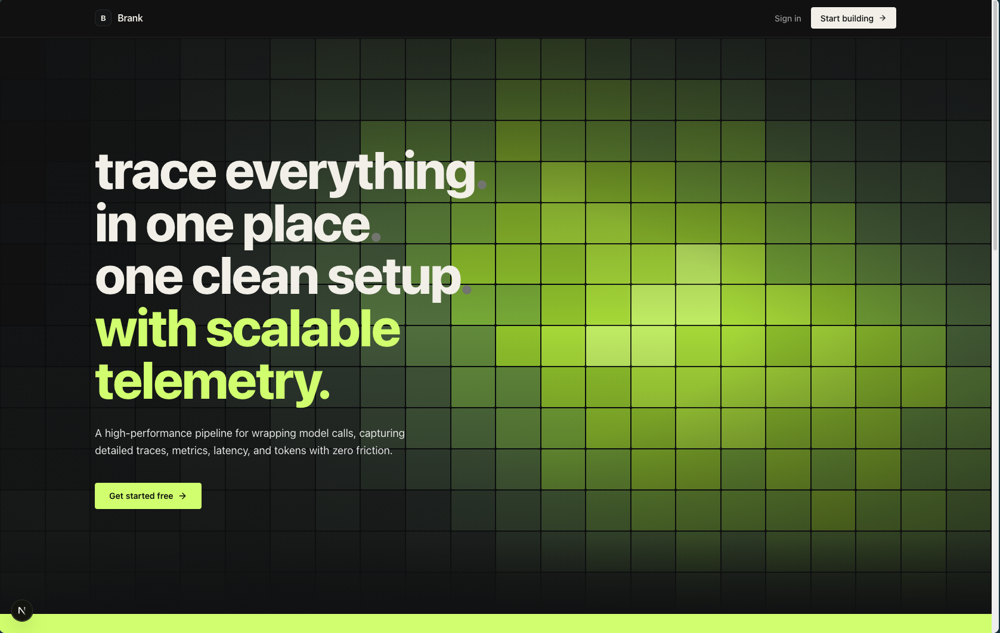
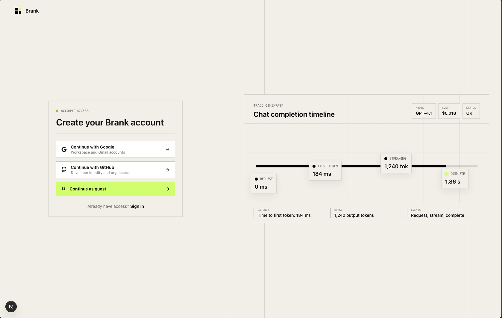
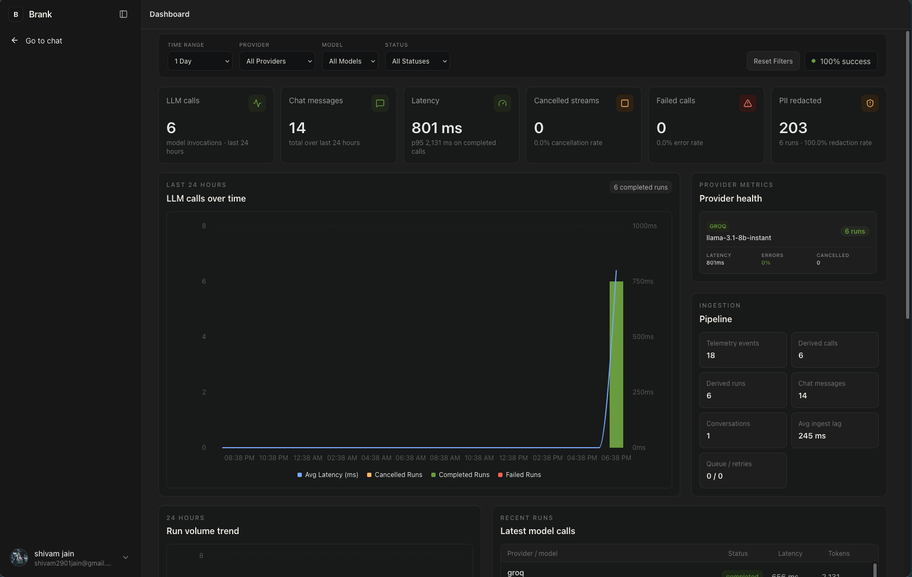
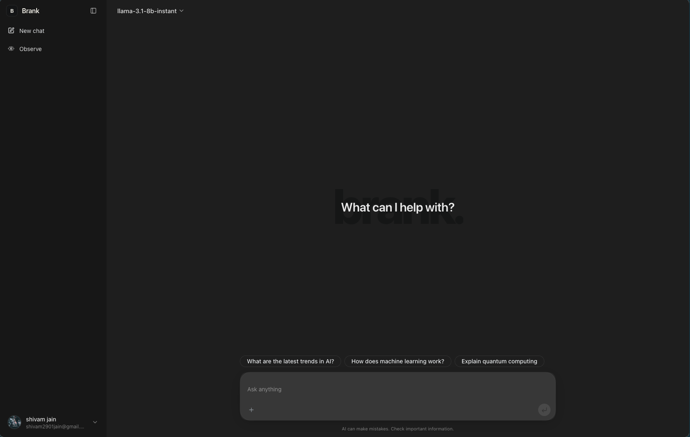

# Brank


**Brank** is a lightweight, multi-provider LLM chat application with built-in inference
telemetry. It streams responses from many providers, persists chat history, and surfaces
a compact live dashboard for latency, throughput, token usage, errors, and queue health —
all behind a minimal, developer-observability-first UI.

It is two cooperating parts:

1. A **Next.js chat app** (UI + API routes + producer) that streams completions and emits
   telemetry events.
2. A standalone **ingestion worker** (Bun) that drains the event queue and writes
   append-only telemetry to Postgres.

---

## Screenshots

| Homepage | Auth | Dashboard | Chat |
|----------|------|-----------|------|
|  |  |  |  |

---

## Features

- **Multi-provider streaming chat.** OpenAI, Anthropic, Google, Groq, and OpenAI-compatible
  endpoints (e.g. LM Studio) via the `ai` v7 SDK, with **bring-your-own-key** support so
  users can supply provider keys from the browser.
- **Live inference telemetry.** Every request emits a strict lifecycle of events
  (`started` → `first_token` → `progress` → `completed`/`failed`/`cancelled`) with latency,
  token counts, and redacted previews.
- **Real-time metrics dashboard.** Rolling aggregates (latency, throughput, token usage,
  errors, queue depth) pushed to the UI over SSE.
- **PII-safe by construction.** Raw prompts/responses never leave the SDK unless explicitly
  enabled; telemetry carries only redacted, truncated previews.
- **Auth.** `better-auth` with Google / GitHub OAuth plus an optional guest/anonymous mode.
- **Observability.** Structured JSON logs (`pino` + `pino-pretty` in dev), health endpoint,
  and a clean worker drain on shutdown.

---

## Architecture at a Glance

```
Browser ──► Next.js app (producer)
              │  /api/chat    (streams via @brank/inferhence)
              │  /api/ingest  (SDK events → validate → redact → enqueue)
              │  /api/metrics (SSE dashboard feed)
              ▼  publish
         Queue (RabbitMQ in prod; in-memory in dev)
              ▲  consume (micro-batch)
              │
         Worker (Bun) ──► Postgres (Prisma, system of record)
              │
         Redis  ── opt-in chat history cache (TTL, invalidated on write)
```

See [ARCHITECTURE.md](./ARCHITECTURE.md) for the full breakdown of the producer/consumer
flow, the worker, the queue abstraction, the data model, and deployment.

---

## Stack & Why

**Next.js 16 + Bun.** App Router for the UI; Bun as both the runtime and the worker host.
One toolchain, one package manager, one deploy surface.

**Postgres — system of record.** Conversations, full messages, and append-only inference
events live here. The data is relational (thread → messages → events) and needs strong
consistency, so Postgres (via Prisma + `@prisma/adapter-pg`) is the source of truth, not a
temporary store.

**Redis — opt-in chat cache.** Mirrors recent chat messages/threads (e.g.
`chat:conv:<id>:messages`, `chat:conv:<id>:meta`) with a TTL, invalidated on every write.
If `REDIS_URL` is unset the cache is a no-op and the app reads Postgres directly.

**RabbitMQ — event queue.** Decouples the chat app (producer) from the ingestion worker
(consumer). Durable queue + dead-letter queue so telemetry is never lost on a crash. An
in-memory adapter is the default for local dev — no broker required.

**pino (+ pino-pretty in dev).** Structured JSON operational logs via a `withLogging`
wrapper on API routes (method, path, status, duration). Request logs never contain message
bodies.

**PII handling.** Full chat content stays in `ChatMessage`. Telemetry stores only truncated
input/output **previews** plus token counts, redacted at two boundaries — at SDK egress
(`packages/inferhence/src/redaction.ts`) and again at ingest — so a misconfigured transport
can't leak raw data. Redaction is SDK/ingest-level, deliberately kept out of the log stream.

**Notable libraries.** `ai` v7 SDK + provider packages · `better-auth` · `@tanstack/react-query`
& `react-virtual` · `streamdown` for streaming markdown · `zod` for validation · `shadcn` /
`tailwindcss` v4 UI · `tokenlens` for token accounting.

---

## Monorepo Layout

```
app/                   Next.js app: routes, UI, API handlers
  api/                 chat · ingest · metrics · conversations · models · auth · health
  chat/ dashboard/ settings/ auth/   feature pages
components/             shared UI
lib/                   app glue: db, auth, chat-cache, ingestion-service, logger, config
packages/
  db/                  Prisma client + generated client
  inferhence/          telemetry SDK (provider-agnostic, PII-safe) — see its own README
  ingestion/           worker, queue adapters, prisma store, metrics aggregator
  providers/           multi-provider registry (browser-supplied keys)
prisma/                schema + migrations
public/                static assets / screenshots
k8s/ helm/             deployment manifests
```

---

## Inference & Telemetry (`@brank/inferhence`)

`@brank/inferhence` is a thin, auto-instrumenting SDK that wraps `streamText`/generate
calls. It emits versioned lifecycle events (`inferhence.event.v1`) over an
`InferenceTransport` — the default is `createHttpTransport`, which posts each event to
`/api/ingest` with the event ID as the `idempotency-key` and best-effort retries. The SDK
owns nothing about delivery; the app owns the queue.

It includes dependency-free decorators for buffering, batching, filtering, fan-out, and
retries, plus a mandatory redaction pipeline (emails, phone numbers, card-like values, API
keys, bearer tokens, sensitive keys, custom regex, truncation). Progress events are
throttled by `intervalMs` / `chunkCount` / `tokenThreshold` so you don't get one event per
token.

Full contract and extraction notes live in
[packages/inferhence/docs/README.md](./packages/inferhence/docs/README.md).

---

## Metrics

The dashboard reads rolling aggregates, not the raw table. A composable `MetricsBackend`
interface backs the current `InMemoryMetricsBackend` (rolling buckets) and a future
ClickHouse swap — no caller changes. Aggregates are pushed to the UI over SSE. Telemetry
delivery is best-effort: losing a metric never blocks a chat response.

---

## Quick Start

### Docker (everything)

```bash
cp .env.example .env
docker-compose up --build   # Postgres, Redis, RabbitMQ, migrate, app, worker
```

### Local dev (no broker — in-memory queue)

```bash
bun install
bun run prisma:generate
bun run db:migrate
bun run dev
```

Open `http://localhost:3000`.

> Configure providers via env (`OPENAI_API_KEY`, `GROQ_API_KEY`, `LMSTUDIO_BASE_URL`, …) or
> supply keys from the browser. See `.env.example` for the full list, including queue/worker
> and cache tuning.

---

## Deploy

- **Local:** `docker-compose up --build` (Postgres, Redis, RabbitMQ, migrate, app, worker).
- **Kubernetes:** `kubectl apply -k k8s/` — includes app, worker, Postgres, Redis, RabbitMQ,
  ingress, and a migration Job.
- **Helm:** `helm install brank ./helm/brank`.

All three paths scale the same components (stateless app, fan-out worker, brokers). See
[ARCHITECTURE.md](./ARCHITECTURE.md) for scaling and failure semantics.

---

## Future Improvements

If given more time, the following improvements would be prioritized:
1. **ClickHouse Swap-in:** Swap PostgreSQL with ClickHouse (or another columnar database) for high-throughput, low-cost analytical queries on millions of inference events.
2. **Deep Auto-Instrumentation:** Support auto-patching of popular libraries (like OpenAI and Anthropic clients) using Node/Bun loader hooks or wrapping import symbols.
3. **Advanced PII Masking:** Integrate entity detection frameworks (like Microsoft Presidio) to dynamically detect and mask contextual PII (names, addresses) beyond regex-based redaction.
4. **DLQ Replay Mechanism:** Implement a dashboard feature to inspect, modify, and replay poison messages directly from the Dead-Letter Queue (DLQ).
5. **Real-time Alerting:** Add webhook triggers in the worker to instantly notify Slack/PagerDuty when error rates or latencies cross custom thresholds.

## License

MIT

